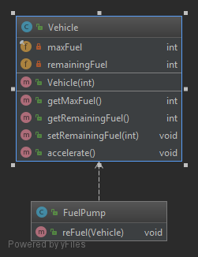
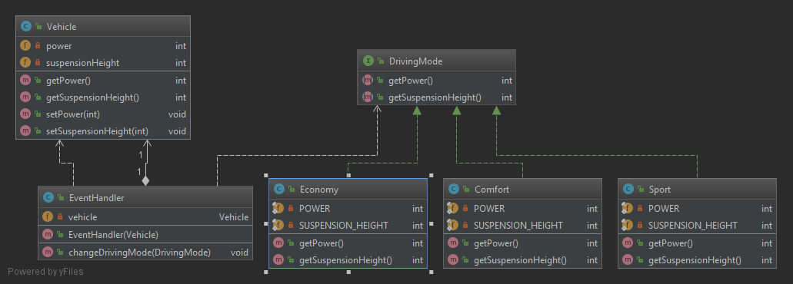
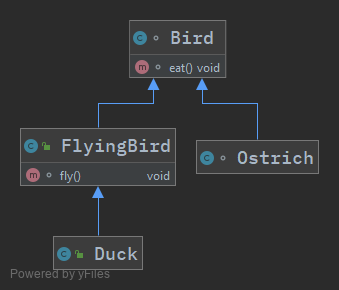
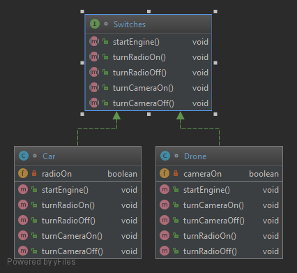
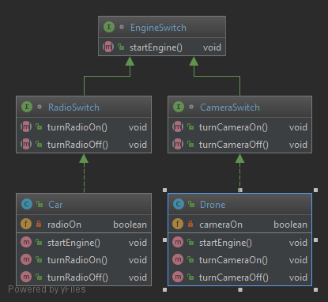
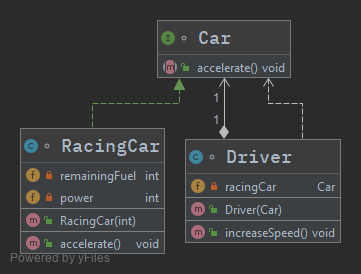

# Principios SOLID

<!-- markdownlint-disable MD033 -->
<div style="text-align: center;">
  
</div>
<!-- markdownlint-disable MD033 -->

SOLID es el acrónimo que acuñó **Michael Feathers**, basándose en los principios de la programación orientada a objetos que **Robert C. Martin** había recopilado en el año 2000 en su paper ["_Design Principles and Design Patterns_"](http://www.cvc.uab.es/shared/teach/a21291/temes/object_oriented_design/materials_adicionals/principles_and_patterns.pdf).

Ocho años más tarde, el _tío Bob_ siguió compendiando consejos y buenas prácticas de desarrollo y se convirtió en el padre del código limpio con su célebre libro _'Clean Code'_.

Entre los objetivos a alcanzar si tenemos en cuenta estos 5 principios a la hora de escribir código encontramos:

- Crear un **software eficaz** que cumpla con su cometido y que sea **robusto y estable**.
- Escribir un **código limpio y flexible** ante los cambios, lo que significa que se pueda modificar fácilmente según necesidad, que sea **reutilizable y mantenible**.
- Permitir **escalabilidad**, o lo que es lo mismo, que acepte ser ampliado con nuevas funcionalidades de manera ágil.

En  este sentido la aplicación de los principios SOLID está muy relacionada con la comprensión y el uso de **patrones de diseño**, que nos permitirán mantener una **alta cohesión** y, por tanto, un **bajo acoplamiento** de software. En definitiva, desarrollar un software de calidad.

El acoplamiento se refiere al **grado de interdependencia que tienen dos unidades de software entre sí**, entendiendo por unidades de software: clases, subtipos, métodos, módulos, funciones, bibliotecas, etc.

Si dos unidades de software son completamente independientes la una de la otra, decimos que están **desacopladas**.

La cohesión de software es el **grado en que elementos diferentes de un sistema permanecen unidos para alcanzar un mejor resultado** que si trabajaran por separado. Se refiere a la forma en que podemos agrupar diversas unidades de software para crear una unidad mayor.

Los principios SOLID son eso: principios, es decir, **buenas prácticas** que pueden ayudar a escribir un mejor código más limpio, mantenible y escalable.

Como indica el propio Robert C. Martin en su artículo “_Getting a SOLID start_” no se trata de reglas, ni leyes, ni verdades absolutas, sino más bien soluciones de sentido común a problemas comunes. Son heurísticos, basados en la experiencia: “se ha observado que funcionan en muchos casos; pero no hay pruebas de que siempre funcionen, ni de que siempre se deban seguir.”

Dice el _tío Bob_, que SOLID nos ayuda a categorizar lo que es un buen o mal código y es innegable que un código limpio tenderá más a salir airoso del “control de calidad de código WTFs/Minute":

<!-- markdownlint-disable MD033 -->
<div style="text-align: center;">
  
</div>
<!-- markdownlint-disable MD033 -->

Los 5 principios SOLID son:

1. ==_**S**ingle Responsability Principle (SRP)_ - Principio de Responsabilidad Única==

    Este [principio](https://es.wikipedia.org/wiki/Principio_de_responsabilidad_%C3%BAnica) establece que cada módulo o clase debe tener **responsabilidad sobre una sola parte de la funcionalidad** proporcionada por el software y esta responsabilidad debe estar encapsulada en su totalidad por la clase. Todos sus servicios deben estar estrechamente alineados con esa responsabilidad.

2. ==_**O**pen/Closed Principle (OCP)_ - Principio de Abierto/Cerrado==

    Este [principio](https://es.wikipedia.org/wiki/Principio_de_abierto/cerrado) establece que **«una entidad de software (clase, módulo, función, etc.) debe quedar abierta para su extensión, pero cerrada para su modificación»**. Es decir, se debe poder extender el comportamiento de la entidad pero sin modificar su código fuente.

3. ==_**L**iskov Substitution Principle (LSP)_ - Principio de Substitución de Liskov==

    Este [principo](https://es.wikipedia.org/wiki/Principio_de_sustituci%C3%B3n_de_Liskov) puede definirse como: **«cada clase que hereda de otra puede usarse como su padre sin necesidad de conocer las diferencias entre ellas»**.

4. ==_**I**nterface Segregation Principle (ISP)_ - Principio de Segregación de la Interfaz==

    Este [principio](https://es.wikipedia.org/wiki/Principio_de_segregaci%C3%B3n_de_la_interfaz) establece que los clientes de un programa dado sólo deberían conocer **aquellos métodos del programa que realmente usan, y no aquellos que no necesitan usar**.

5. ==_**D**ependency Inversion Principle (DIP)_ - Principio de Inversión de Dependencias==

    Este [principio]((https://es.wikipedia.org/wiki/Inyecci%C3%B3n_de_dependencias)) consta de dos partes:

    - **Módulos de alto nivel no deben depender de módulos de bajo nivel**. Ambos deben depender de abstracciones.

    - **Abstracciones no deberían depender de detalles**. Los detalles debieran depender de abstracciones.

## "Single Responsibility Principle"

<!-- markdownlint-disable MD033 -->
<div style="text-align: center;">
  
</div>
<!-- markdownlint-disable MD033 -->

> _"A class should have one, and only one, reason to change"_  
> -- Robert C. Martin

Este principio ayuda a crear código de calidad, mantenible, reusable, testeable, fácil de implementar y previene de efectos secundarios en los cambios. Es aplicable a clases, componentes de software o microservicios.

Los requerimientos del código pueden cambiar con el tiempo. Cada uno de estos cambios en los requerimientos modifica al menos la responsabilidad de una clase. Si una clase tiene muchas responsabilidades deberá cambiar más a menudo que si sólo tuviera una responsabilidad.

Estos cambios tan reiterados pueden introducir errores o efectos secundarios en otras partes del código. Por tanto, **una clase sólo debería cambiar por una única razón** o lo que es lo mismo, que cambie la responsabilidad de la que se ocupa. Es esto, precisamente, "_razón para cambiar"_, lo que Robert C. Martin identifica como "responsabilidad".

Las clases con una única responsabilidad son más fáciles de mantener y más fáciles de explicar.

### Implementación

En el siguiente ejemplo tenemos la clase `Vehicle` que modela un vehículo y sus propiedades y que además tiene la responsabilidad de repostar el vehículo. Por tanto si cambia el modelo `Vehicle` o si cambia la forma de repostar combustible esta clase tendrá dos motivos para cambiar, por lo que claramente esta clase no cumple este principio:

```java
class Vehicle {
    private final int maxFuel;
    private int remainingFuel;

    public Vehicle(final int maxFuel) {
        this.maxFuel = maxFuel;
        remainingFuel = maxFuel;
    }

    // Esto no es responsabilidad de la clase 'Vehicle'
    public void reFuel() {
        remainingFuel = maxFuel;
    }

    public int getMaxFuel() {
        return maxFuel;
    }

    public int getRemainingFuel() {
        return remainingFuel;
    }

    // ....
}
```

Para aplicar este principio deberemos refactorizar la clase `Vehicle` y crear una clase como por ejemplo `FuelPump` cuya responsabilidad sea el repostaje de combustible del vehículo, eliminando este método de la clase `Vehicle`:

<!-- markdownlint-disable MD033 -->
<div style="text-align: center;">
  
</div>
<!-- markdownlint-disable MD033 -->

Quedando la nueva clase de esta forma:

```java
class FuelPump {
    void reFuel(final Vehicle vehicle) {
        final int remainingFuel = vehicle.getRemainingFuel();
        final int additionalFuel = vehicle.getMaxFuel() - remainingFuel;
        vehicle.setRemainingFuel(remainingFuel + additionalFuel);
    }
}
```

## "Open/Closed Principle"

<!-- markdownlint-disable MD033 -->
<div style="text-align: center;">
  
</div>
<!-- markdownlint-disable MD033 -->

> _"Software entities (classes, modules, functions, etc...) should be open for extension, but closed for modification"_  
> -- Robert C. Martin

La idea es escribir código de forma que sea posible **añadir nuevas funcionalidades pero sin modificar el código existente**. Esto previene situaciones en que al modificar clases base nos veamos obligados también a adaptar todas las clases dependientes.

Inicialmente este principio se basaba en el uso de la herencia pero **Robert C. Martin** y otros autores con el tiempo y la experiencia llegaron a la conclusión que la herencia crea una fuerte dependencia entre las clases. Es recomendable el uso de **interfaces** en lugar de la herencia.

El mayor beneficio es que las interfaces introducen una capa extra de abstracción que otorga un bajo nivel de acoplamiento. Las implementaciones que hace cada clase de esa interfaz son independientes unas de otras y no necesitan compartir el código.

En el caso de que los beneficios de compartir código fueran notables sería mejor optar por la herencia o la composición.

### Implementación

En el siguiente ejemplo tenemos la clase `EventHandler` con el método `changeDrivingMode()` que permite cambiar ciertos parámetros de la clase `Vehicle` según el modo de conducción. Este modo de conducción se codifica en una enumeración:

```java
class EventHandler {

    enum DrivingMode {
        SPORT, COMFORT
    }

    private Vehicle vehicle;

    public EventHandler(final Vehicle vehicle) {
        this.vehicle = vehicle;
    }

    void changeDrivingMode(final DrivingMode drivingMode) {
        switch (drivingMode) {
            case SPORT:
                vehicle.setPower(500);
                vehicle.setSuspensionHeight(10);
                break;
            case COMFORT:
                vehicle.setPower(400);
                vehicle.setSuspensionHeight(20);
                break;
            default:
                vehicle.setPower(200);
                vehicle.setSuspensionHeight(30);
                break;
            // Cuando necesitemos añadir otro modo (e.g. ECONOMY) 
            // deberemos cambiar la clase 'EventHandler' 
            // y la enumeración 'DrivingMode'.
        }
    }
}
```

```java
class Vehicle {
    private int power;
    private int suspensionHeight;

    int getPower() {
        return power;
    }

    void setPower(final int power) {
        this.power = power;
    }

    int getSuspensionHeight() {
        return suspensionHeight;
    }

    void setSuspensionHeight(final int suspensionHeight) {
        this.suspensionHeight = suspensionHeight;
    }
}
```

El principio se incumple ya que si tenemos que añadir un nuevo modo de conducción, deberemos añadir el nuevo modo en la enumeración y además deberemos modificar el método `changeDrivingMode(DrivingMode drivingMode)` para tener en cuenta este nuevo modo.

Para cumplir este principio deberemos refactorizar el código de forma que el método `changeDrivingMode(DrivingMode drivingMode)` no necesite ser modificado si se añade nueva funcionalidad o nuevos modos de conducción. Por tanto debe permanecer cerrado a la modificación.

Esto lo podemos conseguir haciendo uso de las **interfaces** (en vez del uso de la herencia) de modo que en el método `changeDrivingMode(DrivingMode drivingMode)` utilicemos la interfaz `DrivingMode`. Las clases que modelan los modos de conducción implementarán dicha interfaz. Si en el futuro necesitamos añadir un nuevo modo de conducción únicamente será necesario añadir la nueva clase que implemente la interfaz `DrivingMode` para que el sistema tenga en cuenta el nuevo modo. El método `changeDrivingMode(DrivingMode drivingMode)` permanecerá inalterado y plenamente funcional ya que este método hace uso de la interfaz y ésta no se ha modificado.

<!-- markdownlint-disable MD033 -->
<div style="text-align: center;">
  
</div>
<!-- markdownlint-disable MD033 -->

```java
interface DrivingMode {
    int getPower();
    int getSuspensionHeight();
}
```

```java
class Comfort implements DrivingMode {
    private static final int POWER = 400;
    private static final int SUSPENSION_HEIGHT = 20;

    @Override
    public int getPower() {
        return POWER;
    }

    @Override
    public int getSuspensionHeight() {
        return SUSPENSION_HEIGHT;
    }
}
```

```java
class Sport implements DrivingMode {
    private static final int POWER = 500;
    private static final int SUSPENSION_HEIGHT = 10;

    @Override
    public int getPower() {
        return POWER;
    }

    @Override
    public int getSuspensionHeight() {
        return SUSPENSION_HEIGHT;
    }
}
```

```java
class EventHandler {
    private Vehicle vehicle;

    public EventHandler(final Vehicle vehicle) {
        this.vehicle = vehicle;
    }

    public void changeDrivingMode(final DrivingMode drivingMode) {
        vehicle.setPower(drivingMode.getPower());
        vehicle.setSuspensionHeight(drivingMode.getSuspensionHeight());
        // Ahora, cuando necesitemos añadir otro modo (e.g. ECONOMY) 
        // sólo hay que crear la clase 'Economy'.
    }
}
```

## "Liskov Substitution Principle"

<!-- markdownlint-disable MD033 -->
<div style="text-align: center;">
  
</div>
<!-- markdownlint-disable MD033 -->

Este principio extiende el **_"Open/Closed Principle"_** pero focalizado en el comportamiento de una superclase y sus subtipos.

Este principio define que los **objetos de una superclase deben ser reemplazables por objetos de sus subclases** sin "romper" la aplicación o sistema y sin efectos secundarios. Eso requiere que los objetos de las subclases se comporten de la misma manera que los objetos de la superclase de forma que se puedan usar de forma indistinta.

Para conseguir esto las subclases deberían seguir estas reglas:

- No implementar reglas de validación más estrictas en los parámetros de entrada que las implementadas por la clase base.
- Aplicar al menos las mismas reglas a todos los parámetros de salida aplicados por la clase base.

### Implementación

En el ejemplo tenemos las clases `Duck` y `Ostrich` que heredan de la clase `Bird` y por tanto también sus métodos. Sin embargo, la clase `Ostrich` sobreescribe el método `fly()` porque no aplica:

```java
class Bird {
    void fly() {}
    void eat() {}
}
```

```java
class Ostrich extends Bird {
    void fly(){
        throw new UnsupportedOperationException();
    }
}
```

```java
// ...
public static void main(String[] args) {
    List<Bird> birdList = new ArrayList<>();
    birdList.add(new Bird());
    birdList.add(new Duck());
    birdList.add(new Ostrich());

    // Let the birds fly
    for (Bird b : birdList) {
        b.fly();
    }
}
```

Según este principio deberíamos poder utilizar las clases `Duck` y/o `Ostrich` en lugar de la superclase `Bird`. Debido a que no se cumple este principio no se puede usar de forma indistinta la superclase o las subclases sin generar errores en la aplicación ya que la subclase `Ostrich` tiene unas restricciones superiores a la superclase en el método `fly()`.

Este método lanza una excepción de tipo `'UnsupportedOperationException'` que no se lanza ni en la otra subclase ni en la superclase. Por tanto no se pueden usar de forma indistinta. Si usamos la subclase `Ostrich` deberemos capturar o relanzar dicha excepción.

Para cumplir con este principio refactorizamos la superclase `Bird` y creamos la clase `FlyingBird` que hereda de la clase `Bird`. Movemos el método `fly()` a la subclase correspondiente y la clase `Duck` ahora hereda de la clase `FlyingBrid`. De esta forma podremos usar las subclases y la superclase de forma indistinta.

Podremos usar el método `fly()` independientemente de que tengamos un objeto de tipo `Duck` o `FlyingBird` y podremos usar el método `eat()` independientemente de que tengamos un objeto de tipo `Bird`, `Ostrich`, `Duck` o `FlyingBird`.

<!-- markdownlint-disable MD033 -->
<div style="text-align: center;">
  
</div>
<!-- markdownlint-disable MD033 -->

```java
// Bird.java
class Bird {
    void eat() {}
}

// Ostrich.java
class Ostrich extends Bird { }

// FlyingBird.java
public class FlyingBird extends Bird {
    void fly() {}
}

// Duck.java
public class Duck extends FlyingBird { }
```

```java
// ...
public static void main(String[] args) {
    List<Bird> birdList = new ArrayList<>();
    birdList.add(new Bird());
    birdList.add(new Ostrich());
    birdList.add(new Duck());
    birdList.add(new FlyingBird());

    // Let the birds eat
    for (Bird b : birdList) {
        b.eat();
    }

    List<FlyingBird> flyingBirdList = new ArrayList<>();
    flyingBirdList.add(new Duck());
    flyingBirdList.add(new FlyingBird());

    // Let the flying birds fly
    for (FlyingBird b : flyingBirdList) {
        b.fly();
    }
}
```

## "Interface Segregation Principle"

<!-- markdownlint-disable MD033 -->
<div style="text-align: center;">
  
</div>
<!-- markdownlint-disable MD033 -->

> _"Clients should not be forced to depend upon interfaces that they do not use"_  
> -- Robert C. Martin

El objetivo de este principio, al igual que el **_"Single Responsibility Principle"_** es reducir los efectos secundarios y la frecuencia de los cambios si dividimos el código en múltiples partes independientes.

Al seguir este principio se evitan interfaces infladas que definen métodos para múltiples responsabilidades.

### Implementación

En el ejemplo tenemos las subclases `Drone` y `Car` que implementan la interfaz `Switches`.

<!-- markdownlint-disable MD033 -->
<div style="text-align: center;">
  
</div>
<!-- markdownlint-disable MD033 -->

```java
// Switches.java
interface Switches {
    void startEngine();
    void turnRadioOn();
    void turnRadioOff();
    void turnCameraOn();
    void turnCameraOff();
}

// Car.java
class Car implements Switches {
    private boolean radioOn;

    @Override
    public void startEngine() {
        // ...
    }

    @Override
    public void turnRadioOn() { radioOn = true; }

    @Override
    public void turnRadioOff() { radioOn = false;  }

    @Override
    public void turnCameraOn() {
        // nothing to do here
    }

    @Override
    public void turnCameraOff() {
        // nothing to do here
    }
}

// Drone.java
class Drone implements Switches {
    private boolean cameraOn;

    @Override
    public void startEngine() {
        // ...
    }

    @Override
    public void turnCameraOn() { cameraOn = true; }

    @Override
    public void turnCameraOff() { cameraOn = false; }

    @Override
    public void turnRadioOn() {
        // nothing to do here
    }

    @Override
    public void turnRadioOff() {
        // nothing to do here
    }
}
```

En este ejemplo las subclases, debido a la herencia, se ven obligadas a implementar con un cuerpo vacío los métodos que no les son necesarios. La subclase `Car` se ve obligada a implementar los métodos `turnCameraOn()` y `turnCameraOff()` que son más propios de la subclase `Dron` y pasa lo mismo con los métodos `turnRadioOn()` y `turnRadioOff()`.

Para cumplir con este principio debemos refactorizar el código de forma que en vez de tener una única interfaz con demasiada responsabilidad tengamos tres interfaces con menor responsabilidad y que se adapten mejor a nuestro modelo y a la lógica de negocio.

<!-- markdownlint-disable MD033 -->
<div style="text-align: center;">
  
</div>
<!-- markdownlint-disable MD033 -->

```java
// EngineSwitch.java
interface EngineSwitch {
    void startEngine();
}

// CameraSwitch.java
interface CameraSwitch extends EngineSwitch {
    void turnCameraOn();
    void turnCameraOff();
}

// RadioSwitch
interface RadioSwitch extends EngineSwitch {
    void turnRadioOn();
    void turnRadioOff();
}
```

```java
// Car.java
class Car implements RadioSwitch {
    private boolean radioOn;

    @Override
    public void startEngine() {
        // ....
    }

    @Override
    public void turnRadioOn() { radioOn = true; }

    @Override
    public void turnRadioOff() { radioOn = false; }
}

// Drone.java
class Drone implements CameraSwitch {
    private boolean cameraOn;

    @Override
    public void startEngine() {
        // ....
    }

    @Override
    public void turnCameraOn() { cameraOn = true; }

    @Override
    public void turnCameraOff() { cameraOn = false; }
}
```

Ahora la subclase `Drone` implementa la interfaz `CameraSwitch` y la subclase `Car` implementa la interfaz `RadioSwitch`. Ambas interfaces heredan de la interfaz común `EngineSwitch`.

## "Dependency Inversion Principle"

<!-- markdownlint-disable MD033 -->
<div style="text-align: center;">
  
</div>
<!-- markdownlint-disable MD033 -->

La idea general de este principio es tan simple como importante: los módulos de alto nivel, que brindan una lógica compleja, deben ser fácilmente reutilizables y no verse afectados por los cambios en los módulos de bajo nivel, que brindan funciones de utilidad.

Para lograr eso, se deben introducir **una abstracción que desacople los módulos de alto y bajo nivel entre sí**.

La definición de este principio según **Robert C. Martin** consta de dos partes:

- Los módulos de alto nivel no deben depender de módulos de bajo nivel. Ambos deberían depender de abstracciones.
- Las abstracciones no deben depender de los detalles. Los detalles deben depender de las abstracciones.

Un importante detalle de esta definición es que tanto los módulos de alto nivel como los de bajo nivel dependen de una abstracción. Por tanto no se invierte la dirección de la dependencia como cabría esperar por el nombre del principio sino que se divide la dependencia entre los módulos de alto y bajo nivel introduciendo una abstracción entre ellos.

Si se han aplicado correctamente el **_"Open/Closed Principle"_** y el **_"Liskov Substitution Principle"_** también se ha aplicado este principio.

El **_"Open/Closed Principle"_** requiere que el componente esté abierto a extensión pero cerrado a modificación. Se puede lograr introduciendo interfaces para las que puede proporcionar diferentes implementaciones. La interfaz en sí misma está cerrada a modificaciones y puede ampliarse fácilmente proporcionando una nueva implementación de interfaz.

Sus implementaciones deben seguir el **_"Liskov Substitution Principle"_** para que pueda reemplazarlas con otras implementaciones de la misma interfaz sin "romper" la aplicación o sistema.

### Implementación

En el ejemplo tenemos la clase `Driver` que tiene una dependencia con la clase `RacingCar` ya que en su constructor se instancia un objeto de la clase `RacingCar`:

```java
// RacingCar.java
class RacingCar {
    private int remainingFuel;
    private int power;

    public RacingCar(final int fuel) {
        remainingFuel = fuel;
    }

    void accelerate() {
        power++;
        remainingFuel--;
    }
}

// Driver.java
class Driver {
    private RacingCar racingCar;

    public Driver() {
        this.racingCar = new RacingCar(100);
    }

    void increaseSpeed() {
        this.racingCar.accelerate();
    }
}
```

Para introducir una abstracción que desacople ambas clases creamos la interfaz `Car` de forma que la clase `Driver` en su constructor recibirá un objeto que implementa dicha interfaz. En el ejemplo la clase `RacingCar` implementa dicha interfaz pero si hemos aplicado correctamente los otros principios podremos utilizar otras implementaciones y ampliar la funcionalidad del sistema sin que se produzcan errores.

<!-- markdownlint-disable MD033 -->
<div style="text-align: center;">
  
</div>
<!-- markdownlint-disable MD033 -->

```java
// Car.java
interface Car {
    void accelerate();
}

// RacingCar.java
class RacingCar implements Car {
    private int remainingFuel;
    private int power;

    public RacingCar(final int fuel) {
        remainingFuel = fuel;
    }

    @Override
    public void accelerate() {
        power++;
        remainingFuel--;
    }
}

// Driver.java
class Driver {
    private Car racingCar;

    public Driver(final Car racingCar) {
        this.racingCar = racingCar;
    }

    public void increaseSpeed() {
        this.racingCar.accelerate();
    }
}
```

Este principio está relacionado con el concepto de [inyección de dependencias](https://es.wikipedia.org/wiki/Inyecci%C3%B3n_de_dependencias) ya que será otro sistema el que _'inyecte'_ en tiempo de ejecución la implementación que requiera la clase en el constructor.

---

## Enlaces de interés

- <https://es.wikipedia.org/wiki/SOLID>  
- <https://blogs.msdn.microsoft.com/cdndevs/2009/07/15/the-solid-principles-explained-with-motivational-posters/>  
- <https://www.baeldung.com/solid-principles>
- <https://www.baeldung.com/java-single-responsibility-principle>
- <https://www.baeldung.com/java-open-closed-principle>
- <https://www.baeldung.com/java-liskov-substitution-principle>  
- <https://www.baeldung.com/java-interface-segregation>
- <https://www.baeldung.com/java-dependency-inversion-principle>

## Licencia

[](http://creativecommons.org/licenses/by-sa/4.0/)  
Esta obra está bajo una [licencia de Creative Commons Reconocimiento-Compartir Igual 4.0 Internacional](http://creativecommons.org/licenses/by-sa/4.0/).
